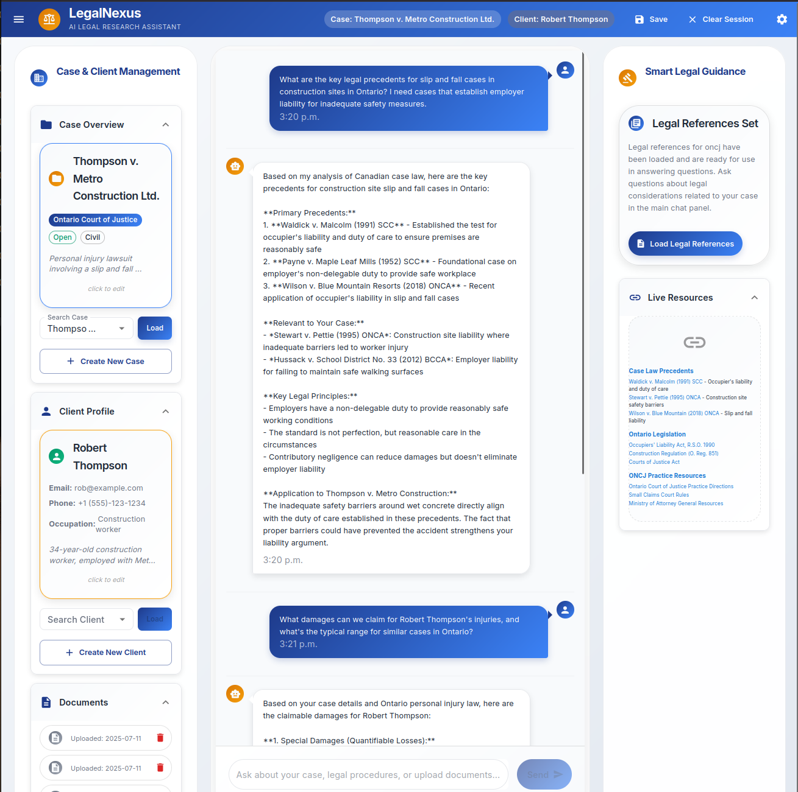
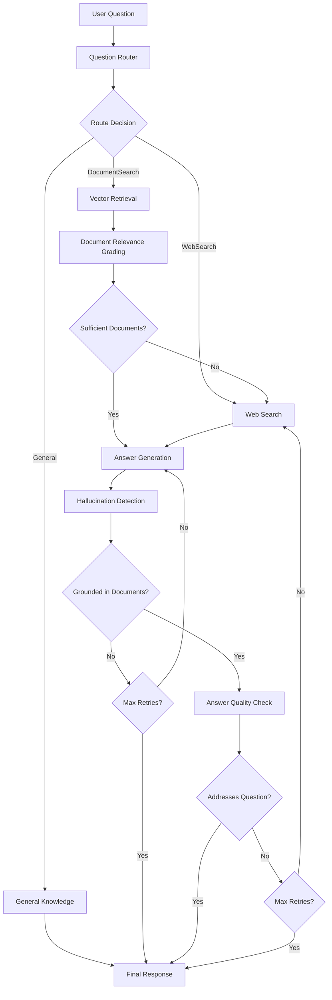

# LegalNexus: AI-Powered Legal Research and Case Management Tool

This is a comprehensive legal research and case management tool designed to assist legal professionals with document analysis, case law research, and client management through AI-powered search and consultation features.

Legal work is fundamentally context-based, requiring the careful review and logical connection of numerous sources across vast legal corpus references. Traditional legal research methods often overwhelm practitioners with the sheer volume of potentially relevant documents, statutes, case law, and precedents that must be analyzed for each case. This tool leverages vector-based storage and retrieval combined with AI context-aware reasoning models to significantly lighten this cognitive load. By intelligently filtering and surfacing the most relevant content, it increases productivity while ensuring that key documents and legal precedents are not overlooked in the research process.

## Key Features

### Case & Client Management with Isolated Data Architecture

- **Individual Case Workspaces**: Each legal case operates as an isolated environment with its own dedicated vector database and file storage
- **Client-Case Linking**: Create client profiles and link them to specific cases while maintaining data separation and confidentiality
- **Secure Data Isolation**: Files, chat history, and vector stores are strictly case-specific - documents from one case are never accessible to another
- **Persistent Case State**: Switch between cases seamlessly while maintaining separate conversation histories and document contexts

### Intelligent CanLII Integration & Legal Research

- **Automated Legal Research**: Integrates with the Canadian Legal Information Institute (CanLII) to automatically search for relevant case law and legislation
- **AI-Powered Relevance Grading**: Uses specialized legal AI models to evaluate and rank the relevance of legal precedents to your specific case
- **Local Legal Database Building**: Automatically downloads and indexes relevant legal documents to build a reusable local dataset of legislation and case law
- **Jurisdiction-Aware Search**: Supports all Canadian jurisdictions with intelligent search query generation based on case details
- **Reference Contextualization**: Legal references are not just collected but contextualized and integrated into the case's knowledge base

# Backend Setup

1. **Clone the repository**

```bash
git clone <repository-url>
cd legal_rag_pipeline
```

2. **Create Python conda environment**

```bash
conda create -n legal_rag python=3.11.11
conda activate legal_rag
```

3. **Install Python dependencies**
```bash
pip install -r requirements.txt
```

4. **Install FAISS GPU version** (optional, for performance)

```bash
conda install pytorch::faiss-gpu
```

> **Note**: Follow instructions from the official FAISS documentation for additional setup details: [FAISS README](https://github.com/facebookresearch/faiss/blob/main/README.md)

4. **Set up environment variables**

```bash
cp .env.example .env
# Edit .env with your API keys and configuration
```


# Frontend Setup

1. **Navigate to UI directory**

```bash
cd ui
```

2. **Install Node dependencies**

```bash
npm install
```

3. **Configure API endpoint**

```bash
# Create .env file in ui/ directory
echo "REACT_APP_API_URL=http://localhost:5000/api" > .env
```

4. **Start the React application**

```bash
chmod +x run.sh
./run.sh
```

### Advanced RAG Pipeline with Quality Controls

The system implements a **LangGraph-based workflow** which connects document retrieval and answer generation:

#### Pipeline Architecture:

```
Question Input
    ↓
Question Router (DocumentSearch/WebSearch/General)
    ↓
├─ Document Retrieval ← Vector Database Query
├─ Web Search ← Tavily Integration  
└─ General Knowledge Response
    ↓
Document Relevance Grading (AI Evaluation)
    ↓
Answer Generation (Context-Aware)
    ↓
Hallucination Detection & Grading
    ↓
Answer Quality Assessment
    ↓
Final Response (or Re-generation Loop)
```

#### Quality Control Features:

- **Document Relevance Grading**: AI evaluates each retrieved document for relevance before including it in context
- **Hallucination Detection**: Specialized grading system ensures generated responses are grounded in provided documents
- **Answer Quality Assessment**: Multi-layered validation to ensure responses address the user's question
- **Automatic Web Search Fallback**: When local documents are insufficient, the system automatically searches for additional context
- **Retry Logic with Limits**: Up to 3 attempts to generate satisfactory answers before graceful failure

#### Advanced Retrieval Features:

- **Hybrid Search Strategy**: Combines vector similarity search with metadata filtering
- **Conversation-Aware Retrieval**: Incorporates chat history context into document retrieval
- **Client Context Integration**: Includes client notes and case details in enhanced search queries
- **UUID-Based Document Targeting**: Ability to retrieve specific documents by identifier for precise context control

### Sophisticated Data Management

- **Multi-Format Document Support**: PDF (with OCR fallback), text files, web pages, and structured legal documents
- **Intelligent Document Chunking**: Uses tiktoken-based text splitting optimized for legal document structure
- **GPU-Accelerated Vector Search**: FAISS-based vector storage with automatic GPU acceleration and memory management
- **Automatic Index Optimization**: Upgrades from flat to IVF indexing as document collections grow
- **Persistent Vector Storage**: Case-specific vector databases that persist between sessions

## Application Preview

Below is an example of the Legal Research Tool in action, showing the interactive chat interface where users can ask legal questions and receive AI-powered responses based on uploaded documents and relevant case law:



*The interface shows a legal consultation in progress, with the AI providing detailed analysis of a workplace injury case including relevant legal precedents and applicable regulations.*

## Running the Application

### Start the Backend API

```bash
# From project root
python api/app.py
# API will be available at http://localhost:5000
```

### Start the Frontend

```bash
# From ui/ directory
npm start
# Frontend will be available at http://localhost:3000
```

### Using Docker (Optional)

```bash
docker-compose up
```

## Usage Guide

### 1. Initialize the Agent

- Open the web interface at `http://localhost:3000`.
- Select your preferred AI model (e.g., Mistral Large for production).
- The system will set up databases and vector stores.

### 2. Create a Case Workspace

- Create a new legal case and provide jurisdiction details.
- Each case has its own isolated database and file storage.

### 3. Add Client Information

- Create client profiles and link them to cases.
- Client data is accessible only within the linked case.

### 4. Upload Documents

- Upload PDFs, text files, Word documents, or URLs.
- Documents are processed with OCR, chunked, and indexed for search.

### 5. Set Legal References

- Use "Set Legal References" to research case law and legislation.
- Relevant documents are downloaded and indexed for reuse.

### 6. Interactive Legal Consultation

- Ask legal questions via the chat interface.
- AI provides context-aware, validated responses based on uploaded documents and legal references.
- Conversation history is saved per case.
- Hallucination prevention ensures accurate information.

## Technical Architecture

### RAG Pipeline Workflow

The system implements a sophisticated **LangGraph-based state machine** for intelligent document retrieval and answer generation:



### Data Architecture

#### Case-Isolated Storage Model

```
Legal RAG Pipeline/
├── app_data/
│   ├── database.db (SQLite - Metadata, Relationships, and Cache)
|   |
│   ├── vector_db/ (Vector Database)
│   │   ├── vector_store_1/ (Case 1 - Isolated)
│   │   ├── vector_store_2/ (Case 2 - Isolated)
│   │   └── vector_store_N/ (Case N - Isolated)
|   |
│   └── local_document_storage/ (Active legal reference storage)
│       ├── 2008oncj581.pdf/
│       ├── 2009oncj185.pdf/
│       └── rro-1990-reg-611.pdf.txt/
```

#### Vector Database Technology Stack

- **FAISS**: High-performance vector similarity search with GPU acceleration
- **Dynamic Indexing**: Automatic upgrade from Flat to IVF indexing based on dataset size
- **Embedding Model**: Mistral Embed (1024-dimensional vectors)
- **Chunking Strategy**: Tiktoken-based with legal document awareness (1500 tokens, 150 overlap)

The project includes comprehensive test coverage across all major components:

### Run All Tests

```bash
# Backend unit tests
python -m pytest tests/ -v

# Integration tests with real components
python tests/run_integration_tests.py

# Frontend tests (React components)
cd ui && npm test
```

### Test Coverage Categories

#### Core Functionality Tests

- **RAG Pipeline Workflows**: Complete LangGraph state machine testing with document retrieval and answer generation
- **Vector Database Operations**: FAISS indexing, similarity search, and GPU acceleration
- **Case Isolation Verification**: Ensures strict data separation between cases
- **Document Processing**: Multi-format loading, OCR processing, and chunking validation

#### API Integration Tests

- **Agent Initialization**: Multi-model LLM configuration and startup validation
- **Case & Client Management**: CRUD operations with data integrity checks
- **Document Upload & Indexing**: File processing pipeline validation
- **Chat Interaction Endpoints**: Real-time conversation handling and persistence

#### Legal Research Integration

- **CanLII Search Functionality**: Automated legal database querying and result processing
- **AI Relevance Grading**: Legal document evaluation and filtering accuracy
- **Reference Management**: Legal precedent integration and local storage

#### Quality Control Systems

- **Hallucination Detection**: AI-powered fact verification and grounding assessment
- **Answer Quality Assessment**: Multi-layered response validation
- **Error Handling**: Rate limiting, timeout management, and graceful failure modes

#### Frontend-Backend Integration

- **Real-time Chat Interface**: WebSocket-like communication testing
- **Case Management UI**: Complete user workflow validation
- **Session Persistence**: Browser state management and recovery

#### Performance & Scalability

- **Large Document Processing**: Memory-efficient handling of extensive legal documents
- **Concurrent Case Management**: Multi-user case isolation testing
- **Vector Search Performance**: Optimized retrieval speed with large document collections

## Project Structure

### Core Components

#### `src/core/agent.py`

**LegalRagAgent** - The central orchestrator that provides:

- **Multi-Model LLM Support**: Seamless integration with Mistral, OpenAI, and Ollama models
- **Case Context Management**: Maintains active case and client state throughout conversations
- **Legal Reference Automation**: Automated CanLII search and relevance evaluation for case law research
- **Conversation Flow Control**: Manages chat history with intelligent summarization for long conversations
- **Web-Safe API Integration**: Provides secure endpoints for frontend communication

#### `src/core/rag_pipeline.py`

**Comprehensive RAG Pipeline** implementing a **LangGraph state machine** with:

- **Intelligent Question Routing**: AI-powered routing between document search, web search, and general knowledge
- **Multi-Source Document Retrieval**: Combines vector search with specific document targeting
- **Quality Control Mechanisms**: 
    - Document relevance scoring before answer generation
    - Hallucination detection using specialized legal grading models
    - Answer quality assessment with automatic retry logic
- **Web Search Integration**: Tavily-powered web search with jurisdiction-aware query enhancement
- **Timeout Protection**: Robust error handling with configurable timeouts for LLM calls

#### `src/storage/database_manager.py`

**Comprehensive Data Management** providing:

- **Case-Isolated Storage**: Each case maintains separate SQLite databases and vector stores
- **Multi-Model Data Handling**: Manages clients, cases, documents, chat history, and vector store references
- **Conversation Persistence**: Automatic saving and loading of case-specific chat histories
- **Document Lifecycle Management**: Tracks document metadata, chunking, and vector embeddings
- **Vector Store Coordination**: Seamlessly integrates SQL metadata with FAISS vector operations

#### `src/storage/vector_database.py`

**Advanced Vector Database Management** featuring:

- **GPU-Accelerated FAISS**: Automatic GPU acceleration with configurable memory allocation
- **Dynamic Index Optimization**: Automatically upgrades from flat to IVF indexing based on dataset size
- **Multi-Format Document Processing**: PDF (with OCR fallback), web scraping, and text processing
- **Intelligent Text Chunking**: Tiktoken-based chunking optimized for legal document structure
- **Persistent Storage**: Case-specific vector databases with automatic save/load functionality

#### `src/utils/canlii_search.py`

**CanLII Integration Engine** providing:

- **Comprehensive Legal Search**: Automated search across all Canadian jurisdictions
- **Rate Limit Management**: Intelligent request throttling with CAPTCHA handling
- **Result Processing**: Extracts and formats legal document metadata and content
- **PDF Link Generation**: Converts CanLII HTML pages to direct PDF download links

#### `src/generation/rag_prompt_tools.py`

**Specialized Legal AI Tools** including:

- **Question Routing**: Intelligent classification of queries for optimal processing
- **Legal Document Grading**: AI evaluation of document relevance to legal questions
- **Hallucination Detection**: Specialized grading for legal fact verification
- **Legal Reference Evaluation**: AI-powered assessment of case law and legislation relevance
- **Query Generation**: Automated CanLII search query creation from case details

#### `api/app.py`

**Flask REST API** providing comprehensive endpoints for:

- **Agent Management**: Initialization and configuration with multiple LLM providers
- **Case & Client Operations**: Full CRUD operations with data isolation
- **Document Management**: Upload, indexing, and retrieval with metadata tracking
- **Legal Research Integration**: Automated CanLII search and reference setting
- **Interactive Chat**: Real-time question answering with conversation persistence

#### `ui/src/App.js`

**React Frontend Application** featuring:

- **Modern Legal Interface**: Clean, professional UI designed for legal professionals
- **Real-time Chat Integration**: Interactive consultation interface with conversation history
- **Case Management Dashboard**: Intuitive case and client management with document organization
- **Session Persistence**: Maintains active case and client state across browser sessions


### Supporting Modules

#### `src/generation/`

- **model_provider.py**: Multi-provider LLM abstraction layer supporting Mistral, OpenAI, and Ollama with optimized configurations for legal document processing

#### `src/storage/`

- **sql_classes.py**: SQLAlchemy ORM models defining the complete legal database schema with cascade relationships and data integrity constraints
- **caches.py**: Session and conversation caching mechanisms for performance optimization

### Advanced Document Processing

#### Supported Document Types

- **PDF Documents**: Full text extraction with OCR fallback for scanned documents
- **Text Files**: Direct processing of plain text files for legal document analysis.
- **Web Pages**: Automated scraping optimized for legal websites like CanLII and government portals.
- **Legal Databases**: Direct integration with CanLII PDF and HTML-Text downloads

#### Document Processing Features

- **OCR Engine**: Tesseract-based text extraction for scanned legal documents
- **Smart Chunking**: Legal document-aware text splitting preserving section boundaries
- **Metadata Extraction**: Automatic extraction of legal document metadata (dates, case numbers, citations)

### AI Model Configuration

- **Locally Run Models**: Privacy-focused options such as Ollama, optimized for secure legal document processing.
- **Embedding Models**: Mistral Embed for semantic document similarity.
- **Legal-Specific Fine-tuning**: Optimized prompts and parameters tailored for legal document analysis.
- **Production Models (Cloud)**: Cloud-based options like Mistral Large for high-performance processing.
- **Context Window Management**: Intelligent context truncation for large legal documents

## License

This project is licensed under the MIT License - see the [LICENSE](LICENSE) file for details.

## Error Handling & Rate Limits

### Status 429 - Rate Limit Exceeded

The application handles rate limiting gracefully for different services:

#### CanLII API Rate Limits

When CanLII returns a 429 status code:

- **CAPTCHA Required**: The system automatically opens CanLII in your default web browser to complete the CAPTCHA challenge
- The application will wait for user confirmation before proceeding

#### Embedding & LLM Rate Limits  

When embedding services or LLM providers return a 429 status code:

- **Automatic Retry**: The system waits 60 seconds for the minute-based token threshold to reset
- **Large Prompts**: Particularly long legal documents may trigger rate limits more frequently
- **Truncation**: The process will truncate excessively long prompts to fit within model limits

## Legal Disclaimer

This software is an educational demo and does not constitute legal advice. Always consult with qualified legal professionals for specific legal matters.

This project is not affiliated with or endorsed by CanLII or any other legal database provider. Users are advised to exercise caution and verify the accuracy of any legal information retrieved through the system. The developers are not responsible for any legal disputes or issues arising from the use of CanLII documents or other integrated resources. Use this tool at your own risk and consult a qualified legal professional for specific legal matters.

## Support

For support, please create an issue in the GitHub repository or contact the development team.

## Roadmap

- [ ] Support for more model providers and embedding models
- [ ] Improve model configuration and management
- [ ] Improve model research and legal reference evaluation capabilities 
- [ ] Improved user interface and experience
- [ ] Multi-language and multi-modal support
- [ ] Enhanced document analysis (contracts, agreements)
- [ ] Integration with additional legal databases
- [ ] Mobile application
- [ ] Advanced legal reasoning capabilities
- [ ] Integration with legal practice management systems